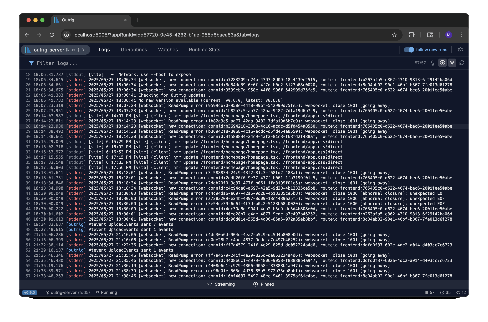

# Outrig

<p align="center">
  <picture>
    <source media="(prefers-color-scheme: dark)" srcset="assets/logo-dark.png" width="300">
    <source media="(prefers-color-scheme: light)" srcset="assets/logo-light.png" width="300">
    
  </picture>
</p>

Outrig is an open-source, dev-time observability tool for Go programs — think Chrome DevTools for Go. Search logs, monitor goroutines, track variables, and explore runtime metrics. Integrate in seconds.

Outrig runs 100% locally. No data ever leaves your machine.

It is currently available for MacOS and Linux (Windows builds coming soon).

<p align="center">
  
</p>

## Features

- **Real-time Log Viewing**: Stream and search logs from your Go application in real-time
- **Goroutine Monitoring**: Track and inspect goroutines, including custom naming
- **Variable Watching**: Monitor variables and counters in your application
- **Runtime Hooks**: Execute hooks in your running application
- **Minimal Integration**: Integrate into your go application in seconds

## How It Works

Outrig consists of two main components that work together:

1. **SDK Client**: A lightweight Go library that you import into your application. It collects logs, goroutine information, and other runtime data from your application and sends it to the Outrig server.

2. **Outrig Server**: A standalone server that receives data from your application, processes it, and provides a web interface for real-time monitoring and debugging.

## Installation

### For Users

For MacOS:

```bash
brew tap outrigdev/outrig
brew install outrig
```

For Linux:

```bash
# Quick installation script (installs to ~/.local/bin)
curl -sf https://raw.githubusercontent.com/outrigdev/outrig/main/assets/install.sh | sh
```

Alternatively, you can download the latest release from the [releases page](https://github.com/outrigdev/outrig/releases). We have deb, rpm, and tar.gz packages available (since outrig is a go program it is just a single binary).

For developers interested in building from source, see [BUILD.md](docs/BUILD.md). If you've already cloned the repository, you can build and install with:

```bash
# Build from source and install to ~/.local/bin
task install
```

## Usage

### Integrating with Your Go Application

Add Outrig to your Go application with a single line:

```go
package main

import "github.com/outrigdev/outrig"

func main() {
    // Initialize Outrig with default configuration
    outrig.Init(nil)

    // Defer AppDone to signal when the application exits
    defer outrig.AppDone()

    // Your application code here
}
```

### Running the Outrig Server

```bash
# Start the Outrig server
outrig server
```

## Key Features

### Logs

Outrig captures and displays logs from your Go application in real-time out of the box by tee-ing stdout/stderr.

```go
// Logs are automatically captured from stdout and stderr
fmt.Println("This will be captured by Outrig")
log.Printf("Standard Go logging is captured too")
```

Features:

- Real-time log streaming
- Instant type-ahead progressive searching
- Advanced search and filtering capabilities (exact match, fuzzy search, regexp, ANDs, and ORs)
- Line marking for important logs
- Follow mode to automatically track latest logs

### Watches

Easily monitor variables in your application. Outrig can display structures (JSON or %v output) and numeric values (easy graphing and historical data viewing coming soon).

```go
// Watch a counter with mutex protection
counter := 0
mutex := &sync.Mutex{}
outrig.WatchCounterSync("app.counter", mutex, &counter)

// Watch an atomic value
var atomicCounter atomic.Int64
outrig.WatchAtomicCounter("app.atomic_counter", &atomicCounter)

// Watch using a function (can use whatever synchronization method you'd like)
outrig.WatchFunc("app.config", func() string {
    return app.GetConfig()
}, nil)

// Set up a Watch by pushing a value
outrig.TrackValue("app.push1", myVal)
```

### Goroutine Monitoring

Outrig dumps your goroutine stack traces every second for easy search/viewing. You can optionally name your goroutines for easier inspecting.

```go
go func() {
    outrig.SetGoRoutineName("worker-pool-1")
    // Goroutine code...
}()
```

### Runtime Stats

Outrig gathers runtime stats every second. Including:

- Memory usage breakdown with visual charts
- CPU usage monitoring
- Goroutine count tracking
- Heap memory allocation statistics
- Garbage collection cycle monitoring
- Process information display (PID, uptime, etc.)
- Go runtime version and environment details

## Architecture

The Outrig codebase is organized into three main components:

1. **Client SDK** (`outrig.go` and `pkg/`): A lightweight Go library that integrates with your application. It collects logs, goroutine information, and other runtime data and sends it to the Outrig server.

2. **Server** (`server/`): A standalone Go server that receives data from your application, processes it, and exposes it via an RPC API. The server efficiently stores and indexes the data for quick searching and retrieval. It has a separate go.mod file so its dependencies don't pollute the SDK.

3. **Frontend** (`frontend/`): A React TypeScript application that communicates with the server via WebSocket using RPC calls. It provides a user-friendly interface for monitoring and debugging your application in real-time. It is built and embedded into the outrig server.

### Data Flow

1. Your Go application imports the Outrig SDK and initializes it with `outrig.Init()`
2. The SDK collects logs, goroutine information, and other runtime data
3. This data is sent to the Outrig server via a local domain socket
4. The server processes and stores the data
5. Go to http://localhost:5005 to view and interact with your data

### Performance

- **Minimal overhead by design** — When disconnected, SDK calls perform a single atomic check (~1-5 nanoseconds per call)
- **Disable in Production** — A build flag (+no_outrig) can completely disable SDK at compile time

### Security

- **No open ports** — Your program doesn't expose extra HTTP servers or ports. It attemps to make a domain socket connection to the outrig server. If the domain socket is not found or is not active, the SDK will remain dormant
- **Secure by default** -- All connections stay on localhost (unless you explicitly configure it otherwise); no application data leaves your machine

### Telemetry

To help understand how many people are using Outrig, help prioritize new features, and find/fix bugs we collect _minimal_ anonymous telemetry from the outrig server. It can be disabled on the CLI by running `outrig server --no-telemetry`.

## Development

For information on building from source, setting up a development environment, and contributing to Outrig, see [BUILD.md](docs/BUILD.md).

## Contributing

Please read [CONTRIBUTING.md](CONTRIBUTING.md) for details on our code of conduct and the process for submitting pull requests.

## License

This project is licensed under the Apache 2.0 License - see the [LICENSE](LICENSE) file for details.
