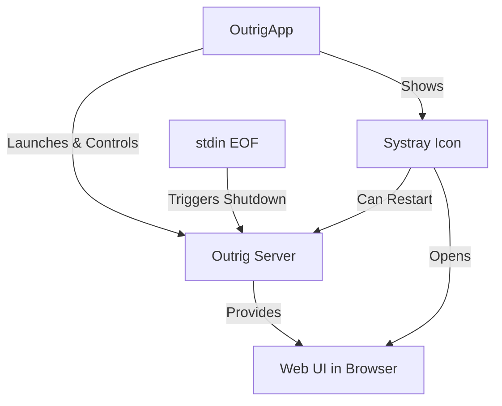

# OutrigApp with Systray Integration - Revised Implementation Plan

## Overview

This document outlines the plan for creating a separate macOS application (`outrigapp`) that will provide systray integration for Outrig using the [getlantern/systray](https://github.com/getlantern/systray) package. This app will run in the background with a menu bar icon and dropdown menu, and will control the existing Outrig server.

## Key Design Decisions

1. **Always Run Server**: The Outrig server will always run when the systray app is running
2. **Lifecycle Management**: When the systray app quits, it will also shut down the server
3. **Failsafe Mechanism**: Add a `--close-on-stdin` flag to the Outrig server that will make it shut down if it reads an EOF from stdin
4. **Restart Option**: Include a "Restart Server" option in the menu to restart the Outrig server

## Architecture



This architecture keeps the macOS framework dependencies separate from the core Outrig server, preventing pollution of the main codebase with platform-specific code.

## Component Structure

### 1. OutrigApp (New)
- A standalone Go executable
- Integrates with systray
- Controls the Outrig server process
- Provides menu bar icon and dropdown menu

### 2. Outrig Server (Existing with minor addition)
- Add `--close-on-stdin` flag
- Remains largely unchanged
- Controlled by OutrigApp
- Continues to provide all existing functionality

## App Bundle Structure

```
Outrig.app/
  └─ Contents/
     ├─ Info.plist
     ├─ MacOS/
     │   ├─ outrigapp (new executable)
     │   └─ outrig (existing executable)
     └─ Resources/
         ├─ AppIcon.icns
         └─ (other resources)
```

The `outrigapp` executable will be the main entry point registered in Info.plist.

## Implementation Steps

### 1. Add `--close-on-stdin` Flag to Outrig Server

Modify `server/main-server.go` to add the new flag:

```go
// Add to serverCmd flags
serverCmd.Flags().Bool("close-on-stdin", false, "Shut down the server when stdin is closed")

// Add to serverCmd.RunE function
closeOnStdin, _ := cmd.Flags().GetBool("close-on-stdin")
if closeOnStdin {
    go func() {
        // Read from stdin until EOF
        buffer := make([]byte, 1)
        for {
            _, err := os.Stdin.Read(buffer)
            if err != nil {
                // EOF or other error, shut down the server
                log.Printf("Stdin closed, shutting down server")
                // Signal the server to shut down
                cancel()
                return
            }
        }
    }()
}
```

### 2. Create OutrigApp

#### 2.1 Create a new Go module for OutrigApp

Create a new directory and initialize a Go module:

```bash
mkdir -p cmd/outrigapp
cd cmd/outrigapp
go mod init github.com/outrigdev/outrigapp
```

#### 2.2 Implement the OutrigApp main.go

```go
package main

import (
    "fmt"
    "io"
    "log"
    "os"
    "os/exec"
    "path/filepath"
    "runtime"
    "sync"
    "time"

    "github.com/getlantern/systray"
)

var (
    // Version information (set during build)
    Version   = "dev"
    BuildTime = ""
    Commit    = ""
    
    // Server process
    serverCmd *exec.Cmd
    serverLock sync.Mutex
)

func main() {
    // Set up logging
    logFile, err := os.OpenFile(filepath.Join(os.TempDir(), "outrigapp.log"), os.O_CREATE|os.O_WRONLY|os.O_APPEND, 0666)
    if err == nil {
        log.SetOutput(logFile)
        defer logFile.Close()
    }
    
    log.Printf("Starting OutrigApp %s", Version)
    
    // Run systray
    systray.Run(onReady, onExit)
}

func onReady() {
    // Set up the systray icon
    systray.SetIcon(getIcon())
    systray.SetTitle("Outrig")
    systray.SetTooltip("Outrig - Go Debugging Tool")

    // Create menu items
    mOpen := systray.AddMenuItem("Open Outrig UI", "Open the Outrig web interface")
    mRestart := systray.AddMenuItem("Restart Server", "Restart the Outrig server")
    systray.AddSeparator()
    mVersion := systray.AddMenuItem(fmt.Sprintf("Version: %s", Version), "OutrigApp version")
    mVersion.Disable()
    systray.AddSeparator()
    mQuit := systray.AddMenuItem("Quit", "Quit OutrigApp and Outrig Server")

    // Start the server immediately
    startServer()

    // Handle menu item clicks
    go func() {
        for {
            select {
            case <-mOpen.ClickedCh:
                openBrowser("http://localhost:5005")
            case <-mRestart.ClickedCh:
                restartServer()
            case <-mQuit.ClickedCh:
                systray.Quit()
                return
            }
        }
    }()
}

func onExit() {
    // Clean up here
    log.Println("Exiting OutrigApp...")
    
    // Stop the server
    stopServer()
}

func startServer() {
    serverLock.Lock()
    defer serverLock.Unlock()
    
    log.Println("Starting Outrig server...")
    
    // Get the path to the outrig executable
    outrigPath := getOutrigPath()
    
    // Start the server with close-on-stdin flag
    serverCmd = exec.Command(outrigPath, "server", "--close-on-stdin")
    
    // Create a pipe for stdin
    stdin, err := serverCmd.StdinPipe()
    if err != nil {
        log.Printf("Error creating stdin pipe: %v", err)
        return
    }
    
    // We keep stdin open, but if outrigapp crashes, it will close automatically
    // causing the server to shut down due to the --close-on-stdin flag
    
    // Set up stdout and stderr
    serverCmd.Stdout = os.Stdout
    serverCmd.Stderr = os.Stderr
    
    err = serverCmd.Start()
    if err != nil {
        log.Printf("Error starting server: %v", err)
        return
    }
    
    // Wait a bit for the server to start
    time.Sleep(1 * time.Second)
    
    log.Println("Outrig server started")
    
    // Monitor the server process in a goroutine
    go func(cmd *exec.Cmd, stdinPipe io.WriteCloser) {
        err := cmd.Wait()
        if err != nil {
            log.Printf("Server process exited with error: %v", err)
        } else {
            log.Println("Server process exited normally")
        }
        
        // Close stdin pipe
        stdinPipe.Close()
    }(serverCmd, stdin)
}

func stopServer() {
    serverLock.Lock()
    defer serverLock.Unlock()
    
    log.Println("Stopping Outrig server...")
    
    if serverCmd != nil && serverCmd.Process != nil {
        // Send interrupt signal to the server
        err := serverCmd.Process.Signal(os.Interrupt)
        if err != nil {
            log.Printf("Error sending interrupt signal: %v", err)
            // Try to kill the process if interrupt fails
            err = serverCmd.Process.Kill()
            if err != nil {
                log.Printf("Error killing process: %v", err)
            }
        }
        
        // Wait for the process to exit (with timeout)
        done := make(chan error, 1)
        go func() {
            _, err := serverCmd.Process.Wait()
            done <- err
        }()
        
        // Wait for process to exit or timeout
        select {
        case err := <-done:
            if err != nil {
                log.Printf("Error waiting for process to exit: %v", err)
            }
        case <-time.After(5 * time.Second):
            log.Println("Timeout waiting for server to exit, forcing kill")
            serverCmd.Process.Kill()
        }
        
        serverCmd = nil
    }
    
    log.Println("Outrig server stopped")
}

func restartServer() {
    log.Println("Restarting Outrig server...")
    
    // Stop and start the server
    stopServer()
    startServer()
    
    log.Println("Outrig server restarted")
}

// getOutrigPath returns the path to the outrig executable
func getOutrigPath() string {
    // In development mode, use the outrig in PATH
    if os.Getenv("OUTRIGAPP_DEV") != "" {
        return "outrig"
    }
    
    // In production mode, use the outrig in the same directory
    execPath, err := os.Executable()
    if err != nil {
        log.Printf("Error getting executable path: %v", err)
        return "outrig"
    }
    
    return filepath.Join(filepath.Dir(execPath), "outrig")
}

// openBrowser opens the default browser to the specified URL
func openBrowser(url string) {
    var err error
    switch runtime.GOOS {
    case "linux":
        err = exec.Command("xdg-open", url).Start()
    case "windows":
        err = exec.Command("rundll32", "url.dll,FileProtocolHandler", url).Start()
    case "darwin":
        err = exec.Command("open", url).Start()
    default:
        err = fmt.Errorf("unsupported platform")
    }
    if err != nil {
        log.Printf("Error opening browser: %v", err)
    }
}

// getIcon returns the icon data
func getIcon() []byte {
    // For a real implementation, load an icon file
    // This is a placeholder - replace with actual icon data
    return []byte{
        // Icon data here
    }
}
```

### 3. App Bundle Creation

#### 3.1 Create an Info.plist template

Create a file `assets/macos/Info.plist`:

```xml
<?xml version="1.0" encoding="UTF-8"?>
<!DOCTYPE plist PUBLIC "-//Apple//DTD PLIST 1.0//EN" "http://www.apple.com/DTDs/PropertyList-1.0.dtd">
<plist version="1.0">
<dict>
    <key>CFBundleExecutable</key>
    <string>outrigapp</string>
    <key>CFBundleIconFile</key>
    <string>AppIcon</string>
    <key>CFBundleIdentifier</key>
    <string>dev.outrig.Outrig</string>
    <key>CFBundleInfoDictionaryVersion</key>
    <string>6.0</string>
    <key>CFBundleName</key>
    <string>Outrig</string>
    <key>CFBundlePackageType</key>
    <string>APPL</string>
    <key>CFBundleShortVersionString</key>
    <string>{{.Version}}</string>
    <key>CFBundleVersion</key>
    <string>{{.Version}}</string>
    <key>LSMinimumSystemVersion</key>
    <string>10.13</string>
    <key>LSUIElement</key>
    <true/>
    <key>NSHighResolutionCapable</key>
    <true/>
    <key>NSHumanReadableCopyright</key>
    <string>Copyright © 2025 Command Line Inc. All rights reserved.</string>
</dict>
</plist>
```

Note the `LSUIElement` key is set to `true`, which makes the app run as an agent without showing in the Dock.

#### 3.2 Create a script to generate the .app bundle

Create a file `assets/macos/create-app-bundle.sh`:

```bash
#!/bin/bash
# Script to create a macOS .app bundle for Outrig

# Check arguments
if [ "$#" -ne 4 ]; then
    echo "Usage: $0 <outrigapp-binary-path> <outrig-binary-path> <version> <output-dir>"
    exit 1
fi

OUTRIGAPP_BINARY_PATH="$1"
OUTRIG_BINARY_PATH="$2"
VERSION="$3"
OUTPUT_DIR="$4"

# Create app bundle structure
APP_NAME="Outrig.app"
APP_BUNDLE="$OUTPUT_DIR/$APP_NAME"
CONTENTS_DIR="$APP_BUNDLE/Contents"
MACOS_DIR="$CONTENTS_DIR/MacOS"
RESOURCES_DIR="$CONTENTS_DIR/Resources"

mkdir -p "$MACOS_DIR"
mkdir -p "$RESOURCES_DIR"

# Copy binaries
cp "$OUTRIGAPP_BINARY_PATH" "$MACOS_DIR/outrigapp"
cp "$OUTRIG_BINARY_PATH" "$MACOS_DIR/outrig"

# Make binaries executable
chmod +x "$MACOS_DIR/outrigapp"
chmod +x "$MACOS_DIR/outrig"

# Process Info.plist
sed "s/{{.Version}}/$VERSION/g" "assets/macos/Info.plist" > "$CONTENTS_DIR/Info.plist"

# Copy icon
cp "assets/macos/AppIcon.icns" "$RESOURCES_DIR/"

echo "Created app bundle at $APP_BUNDLE"
```

#### 3.3 Create an icon in .icns format

You'll need to create an AppIcon.icns file for the app. This can be done using the macOS Icon Composer or other tools.

### 4. Hello World Example

For a quick test of the systray functionality, you can create a simple hello world app:

```go
package main

import (
    "fmt"
    "os"
    "os/exec"
    "runtime"

    "github.com/getlantern/systray"
)

func main() {
    systray.Run(onReady, onExit)
}

func onReady() {
    systray.SetTitle("Hello")
    systray.SetTooltip("Hello World Systray App")
    
    mHello := systray.AddMenuItem("Say Hello", "Say hello to the world")
    mQuit := systray.AddMenuItem("Quit", "Quit the app")
    
    go func() {
        for {
            select {
            case <-mHello.ClickedCh:
                fmt.Println("Hello, World!")
            case <-mQuit.ClickedCh:
                systray.Quit()
                return
            }
        }
    }()
}

func onExit() {
    fmt.Println("Exiting...")
}
```

### 5. Build Configuration

#### 5.1 Create a Makefile for OutrigApp

Create a file `cmd/outrigapp/Makefile`:

```makefile
.PHONY: build clean

VERSION ?= dev
COMMIT ?= $(shell git rev-parse --short HEAD)
BUILD_TIME ?= $(shell date -u +"%Y-%m-%dT%H:%M:%SZ")

build:
	go build -ldflags "-X main.Version=$(VERSION) -X main.BuildTime=$(BUILD_TIME) -X main.Commit=$(COMMIT)" -o outrigapp

clean:
	rm -f outrigapp
```

#### 5.2 Update GoReleaser Configuration

Create a separate GoReleaser configuration for OutrigApp or update the existing one to include both builds:

```yaml
# .goreleaser.yaml
builds:
  - id: outrig
    main: ./main-server.go
    dir: ./server
    binary: outrig
    ldflags:
      - -X main.OutrigVersion={{.Version}} -X main.OutrigBuildTime={{.Timestamp}} -X main.OutrigCommit={{.ShortCommit}}
    goos:
      - linux
      - darwin
    goarch:
      - amd64
      - arm64
    env:
      - CGO_ENABLED=0

  - id: outrigapp
    main: ./main.go
    dir: ./cmd/outrigapp
    binary: outrigapp
    ldflags:
      - -X main.Version={{.Version}} -X main.BuildTime={{.Timestamp}} -X main.Commit={{.ShortCommit}}
    goos:
      - darwin  # Only build for macOS
    goarch:
      - amd64
      - arm64
    env:
      - CGO_ENABLED=0

# Add a new hook to create the .app bundle for macOS builds
after:
  hooks:
    - cmd: ./assets/macos/create-app-bundle.sh dist/outrigapp_{{.Version}}_darwin_{{if eq .Arch "amd64"}}x86_64{{else}}{{.Arch}}{{end}}/outrigapp dist/outrig_{{.Version}}_darwin_{{if eq .Arch "amd64"}}x86_64{{else}}{{.Arch}}{{end}}/outrig {{.Version}} dist/
      env:
        - GOOS=darwin

# Update archives to include the .app bundle
archives:
  - id: default
    name_template: >
      {{- .ProjectName }}_{{ .Version }}_{{ title .Os }}_{{ if eq .Arch "amd64" }}x86_64{{ else if eq .Arch "386" }}i386{{ else }}{{ .Arch }}{{ end -}}
    wrap_in_directory: true
    files:
      - LICENSE
      - README.md
      - NOTICE
      - src: dist/Outrig.app
        dst: Outrig.app
        strip_parent: true
```

## Testing the Implementation

1. Build and run the hello world example:
   ```bash
   cd cmd/outrigapp
   go mod init github.com/outrigdev/outrigapp
   go get github.com/getlantern/systray
   go build -o hello-systray hello.go
   ./hello-systray
   ```

2. Build and run the full OutrigApp:
   ```bash
   cd cmd/outrigapp
   make build
   ./outrigapp
   ```

3. Test the app bundle:
   ```bash
   ./assets/macos/create-app-bundle.sh ./cmd/outrigapp/outrigapp ./outrig 1.0.0 ./dist
   open ./dist/Outrig.app
   ```

## Next Steps

1. Create the OutrigApp directory and implement the hello world example
2. Test the systray functionality
3. Implement the full OutrigApp
4. Create the necessary assets and scripts
5. Update build configuration
6. Test the complete solution